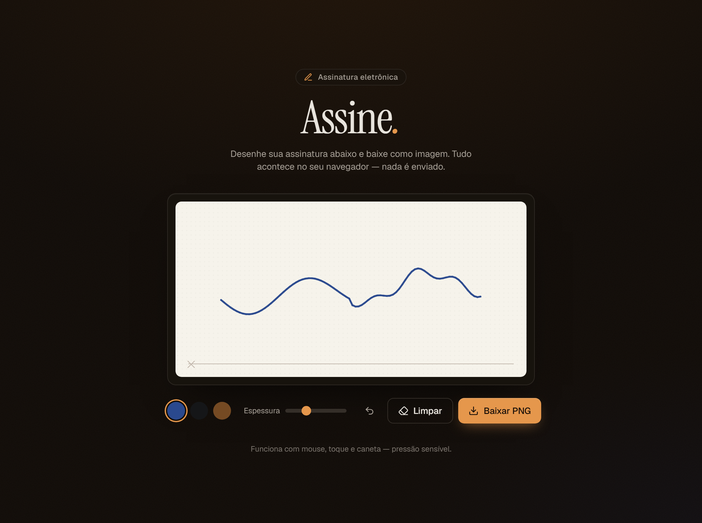

<div align="center">

# ✍️ Assine

**Assinatura eletrônica no navegador** — desenhe com mouse, toque ou caneta e baixe como PNG.
Tudo acontece localmente: nada é enviado para nenhum servidor.



</div>

---

## ✨ Funcionalidades

- 🖊️ **Mouse, toque e caneta** unificados via [Pointer Events](https://developer.mozilla.org/docs/Web/API/Pointer_events) — com **largura sensível à pressão**.
- 🔍 **Traço nítido em telas HiDPI** (escala por `devicePixelRatio`).
- ↩️ **Desfazer** traço por traço (undo vetorial real) e 🧹 **Limpar**.
- 🎨 **3 cores de tinta** (azul, preto, sépia) e **espessura ajustável**.
- ⬇️ **Baixar PNG** em alta resolução (botões desabilitam quando o quadro está vazio).
- 📱 **Responsivo** e ♿ **acessível** (`aria-label`, foco visível, `lang="pt-BR"`).
- 🔒 **100% no cliente** — privado por padrão.

## 🧰 Tecnologias

| Camada | Stack |
| --- | --- |
| Build | [Vite 6](https://vitejs.dev/) |
| UI | [React 18](https://react.dev/) + [TypeScript](https://www.typescriptlang.org/) (strict) |
| Estilo | [Tailwind CSS v4](https://tailwindcss.com/) + componentes no estilo [shadcn/ui](https://ui.shadcn.com/) |
| Animação | [Motion](https://motion.dev/) |
| Ícones | [lucide-react](https://lucide.dev/) |

> **Design** — tema *"Tinta & Papel"*: superfície de papel creme com linha-guia sobre um fundo carvão com acento âmbar. Tipografia *Instrument Serif* + *Geist*.

## 🚀 Como rodar

Pré-requisito: **Node.js 18+**.

```bash
# instalar dependências
npm install

# ambiente de desenvolvimento (http://localhost:5173)
npm run dev

# build de produção (gera ./dist)
npm run build

# pré-visualizar o build
npm run preview
```

## 📁 Estrutura

```
src/
├─ components/
│  ├─ SignaturePad.tsx   # núcleo do canvas (pointer events, retina, undo vetorial)
│  └─ ui/                # componentes base estilo shadcn (button, card)
├─ lib/utils.ts          # helper cn()
├─ App.tsx               # composição da interface
├─ index.css             # tema (tokens Tailwind v4 + "Tinta & Papel")
└─ main.tsx
```

## 📜 Histórico

Projeto originalmente em JavaScript vanilla (HTML/CSS/JS), reescrito em React + TypeScript com
correção de bugs (suporte a toque/caneta, escala retina, undo real, suavização do traço) e
redesign completo da interface.

---

<div align="center">
<sub>Feito com ☕ por <a href="https://github.com/cielioqueiroz">Cielio Queiroz</a></sub>
</div>
